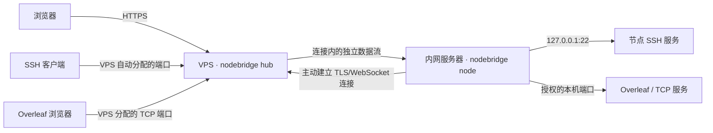

# NodeBridge

一个 Go 程序，两种运行模式，把 Servermanager 和 Clustermanager 的当前 SSH 管理功能收进一个仓库。

- **hub**：部署在有公网 IP 的 VPS，提供 HTTPS 控制台、账号管理、配对和自动端口分配。
- **node**：部署在内网服务器，主动连接 hub，转发本地 SSH 和明确授权的 TCP 服务（例如 Overleaf），并上报节点/GPU 状态。
- WebUI 编译进二进制；生产环境不需要 Python、Node.js、npm、FRP 或单独部署数据库。
- WebUI 沿用原 Clustermanager 的 Azure 风格：中性灰背景、白色面板、Azure 蓝按钮、深色文字和清晰的输入框边界，支持桌面与手机布局。
- 当前重构基线是两个旧仓库的 `simple-tunnel-platform` 分支。Docker 实例、资源配额和卡时计费不属于此分支，功能清单见 [迁移说明](docs/MIGRATION.md)。



## 从现有源码试运行

开发构建需要 [Go 1.26 或更新版本](https://go.dev/dl/)。生产运行只需要 Release 中的二进制。

```bash
make build

# VPS：首次启动只填写用户实际可访问的 HTTPS 地址
./bin/nodebridge hub --public-url https://你的VPS公网IP:9443

# 内网节点：另一个终端或另一台服务器，使用同一个二进制
./bin/nodebridge node
```

VPS 控制台地址是 `https://你的VPS公网IP:9443`。首次启动自动生成随机管理员密码，账号为 `admin`；在 VPS 上读取：

```bash
cat data/hub/initial-admin.txt
```

默认生成自签 HTTPS 证书，浏览器首次访问会提示证书未被信任。启动日志显示证书 SHA-256 指纹，可以与浏览器证书详情核对。节点配对和后续连接自动校验证书指纹。登录后可以修改密码；修改初始管理员密码后，初始密码文件会删除。

登录 VPS 控制台，填写节点名称并点击“生成配对链接”。在节点打开 `http://127.0.0.1:9899`，粘贴链接；没有桌面的服务器直接执行：

```bash
./bin/nodebridge pair
# 在提示后粘贴 nodebridge://pair/... 链接并回车
```

端口分配、TLS 指纹、节点 ID 和独立认证凭证都会自动保存。链接只能使用一次，15 分钟有效。配对完成后，在 VPS 控制台选择节点和 Linux 用户名，复制 SSH 命令。

## 一个命令安装服务

在 Linux/systemd 机器上直接安装最新 Release，不需要 Go、Python、npm 或 FRP。

**VPS（有公网 IP）：** 把下面的 `你的VPS公网IP` 换成实际 IP 或域名。

```bash
curl -fsSL https://github.com/johnfan12/NodeBridge/releases/latest/download/install.sh | sudo bash -s -- hub --public-url https://你的VPS公网IP:9443
```

**内网服务器（无需公网 IP）：**

```bash
curl -fsSL https://github.com/johnfan12/NodeBridge/releases/latest/download/install.sh | sudo bash -s -- node
```

安装后，在 VPS 控制台生成配对链接；在内网服务器执行 `nodebridge pair`，粘贴链接即可。也可以打开节点本地 `http://127.0.0.1:9899` 维护页面完成配对。

脚本自动识别 amd64/arm64、下载对应安装包、校验 SHA-256，并配置 systemd 服务。所有服务以专用普通用户 `nodebridge` 运行，VPS 安装完成会显示首次管理员账号。VPS 需放行默认 TCP `9443` 和配置的 SSH/TCP 端口池，详情见下文。

[最新 Release 和下载文件](https://github.com/johnfan12/NodeBridge/releases/latest) · [安装脚本](https://github.com/johnfan12/NodeBridge/releases/latest/download/install.sh)

也可以手动下载 Release 安装包，解压后运行：

```bash
# VPS
sudo ./install.sh hub --public-url https://你的VPS公网IP:9443

# 内网节点
sudo ./install.sh node
```

从源码构建后，也可以直接安装：

```bash
sudo bash scripts/install.sh hub --public-url https://你的VPS公网IP:9443
sudo bash scripts/install.sh node
```

默认下载仓库的最新正式 Release。需要指定版本或镜像时可以覆盖下载地址，例如固定安装 `v0.1.2`：

```bash
curl -fsSL https://github.com/johnfan12/NodeBridge/releases/download/v0.1.2/install.sh \
  | sudo env NODEBRIDGE_RELEASE_BASE_URL=https://github.com/johnfan12/NodeBridge/releases/download/v0.1.2 \
    bash -s -- hub --public-url https://你的VPS公网IP:9443
```

项目通过 GitHub Actions 发布：推送 `v*` 标签后运行检查、构建安装包，并发布独立安装脚本和校验和。

## 日常页面与管理页面

所有账号登录后默认进入服务器一览（`/`）。首页用一份连续列表展示服务器和连接状态，点击某行“SSH 连接”，在弹窗里填写 Linux 用户名并复制命令；GPU 指标与在线历史在“运行详情”中展开。管理员额外拥有每台服务器的暂停/恢复转发按钮。

管理员通过右上角“管理页面”进入独立的 `/admin` 页面，按“服务器 / 代理 / 账号 / 操作记录”切换功能。点击“接入服务器”或“创建账号”才展开对应表单；全局暂停按钮在“服务器”页签底部的“全局 SSH 转发设置”中。每台服务器的暂停和移除按钮分组留出间距，移除操作保留名称确认。管理页面可通过“服务器一览”返回日常界面。普通用户不显示管理入口，直接访问 `/admin` 会返回首页；管理 API 仍要求管理员身份。

## Overleaf / TCP 端口转发

管理员在 `/admin` 的“代理”页签统一查看 SSH 与 TCP 转发。每个节点的 SSH 代理自动显示；Overleaf 单独创建，不需要新的节点配对或 FRP。

1. 在节点确认 Overleaf 可通过本机访问，例如 `curl http://127.0.0.1:8080`。填写实际监听端口。
2. 打开节点维护页 `http://127.0.0.1:9899`，展开“Overleaf / TCP 端口转发”，授权该端口。
3. 在 VPS 管理页面选择“代理” → “创建端口转发”，填写名称 `Overleaf`，选择节点与已授权端口。公网端口留空自动分配，也可填写端口池内的空闲端口。
4. 放行 VPS 分配的 TCP 端口，点击“打开”或复制地址，例如 `http://你的VPS公网IP:30001`。

没有桌面的节点可授权端口（将 `8080` 替换为实际服务端口）：

```bash
curl -fsS -X POST http://127.0.0.1:9899/api/tcp-ports \
  -H 'Content-Type: application/json' -H 'X-NodeBridge-Request: 1' \
  -d '{"port":8080}'
```

节点只允许连接 `127.0.0.1` 上明确授权的服务端口，最多 16 个；SSH 与维护页端口不能作为额外 TCP 服务授权。Overleaf 容器需要把端口发布到节点回环地址；使用 Toolkit 时可配置 `OVERLEAF_LISTEN_IP=127.0.0.1` 和 `OVERLEAF_PORT=8080`，参见 [Toolkit 配置](https://github.com/overleaf/toolkit/blob/master/doc/overleaf-rc.md)。

当前为原始 TCP 转发，HTTP 路径、上传、Cookie 与 WebSocket 直接传递。**访问 Overleaf 仍由 Overleaf 自身验证账号，NodeBridge 登录不会保护这个公网服务端口。** HTTPS 控制台与节点之间的隧道已加密；浏览器到 `http://VPS:端口` 这一段为 HTTP。本版不自动部署 Nginx、绑定域名或签发证书，这些功能后续增加。生产 HTTPS 可先自行配置反向代理。

单个 TCP 代理可在 VPS 暂停/恢复或删除；节点维护页可暂停本机所有额外 TCP 转发，也可撤销某个端口授权。暂停或撤销会立即中断相应连接，保留 Web 和 SSH。暂停保留公网端口，删除代理才回收端口；删除代理不会停止或卸载 Overleaf。移除整个节点会同步删除其 SSH 和所有 TCP 代理。

新功能需要 hub 与 node 都升级到 v0.2.0 或更新版本。原有节点、配对和 SSH 端口保留；旧版 node 仍可用于 SSH，升级后才会上报已授权 TCP 端口。

## 暂停 / 恢复 SSH 转发（保留 Web）

| 操作位置 | 方法 | 影响范围 |
| --- | --- | --- |
| VPS 管理页面，管理员登录 | “服务器” → “全局 SSH 转发设置” → 暂停 / 恢复 | 全部节点 |
| VPS 服务器列表（首页或管理页） | “暂停节点 SSH” / “恢复节点 SSH” | 所选节点 |
| 本地节点 `http://127.0.0.1:9899` | “连接状态” → “暂停 SSH 转发” / “恢复 SSH 转发” | 本机节点 |

暂停会**立即断开范围内的现有 SSH 会话和文件传输**，阻止新 SSH 转发；Web 页面继续可用，节点在线状态、GPU 指标和配对功能继续运行。不会停止系统的 `sshd` 或删除账号、配置、数据。公网 SSH 端口仍被保留，恢复后使用原来的端口，无需重新配对。暂停状态会保存，重启或更新后仍然有效。

各位置的暂停独立生效：如果 VPS 全局和节点本机都暂停，需要分别恢复；首页服务器列表会显示暂停来源。普通控制台用户只能查看，VPS 的暂停操作需要管理员权限。

无桌面的本地服务器也可以执行：

```bash
# 暂停本机 SSH 转发；维护页使用自定义端口时替换 9899
curl -fsS -X PUT http://127.0.0.1:9899/api/forwarding \
  -H 'Content-Type: application/json' -H 'X-NodeBridge-Request: 1' \
  -d '{"paused":true}'

# 恢复本机 SSH 转发
curl -fsS -X PUT http://127.0.0.1:9899/api/forwarding \
  -H 'Content-Type: application/json' -H 'X-NodeBridge-Request: 1' \
  -d '{"paused":false}'
```

本地维护页和 VPS 控制台共享同一套 Azure 样式。已安装的 hub 和 node 都需要重新执行各自的安装命令才能获得这些按钮与新功能。更新会重启对应服务并断开其 SSH/TCP 连接，建议在空闲时进行。

## 卸载整个服务（Web + 后端）

以下命令适用于一键脚本安装的 Linux/systemd 服务，卸载后对应 Web 页面和 SSH/TCP 转发都停止。

**本地节点：**

```bash
curl -fsSL https://github.com/johnfan12/NodeBridge/releases/latest/download/uninstall.sh | sudo bash -s -- node --purge
```

**远程 VPS：**

```bash
curl -fsSL https://github.com/johnfan12/NodeBridge/releases/latest/download/uninstall.sh | sudo bash -s -- hub --purge
```

**同一台机器同时卸载两种模式：**

```bash
curl -fsSL https://github.com/johnfan12/NodeBridge/releases/latest/download/uninstall.sh | sudo bash -s -- all --purge
```

`--purge` 会永久删除所选模式的配置、配对凭证和数据库（hub 包括账号、端口记录、证书与审计）；需要保留数据以便重新安装时，去掉 `--purge`。脚本会停止并禁用服务、删除 systemd 单元；另一模式仍安装时保留共享二进制。两种模式都卸载且数据均已清除时，也删除共享程序与 `nodebridge` 系统账号。

卸载节点不会自动删除 VPS 的节点记录；在 VPS 控制台“移除节点”可撤销旧凭证并回收端口。重新安装已清理数据的节点需要新的配对链接。卸载 hub 会断开全部转发，重新安装已清理数据的 hub 需要所有节点重新配对。系统 SSH 服务、Linux 用户、用户文件和 GPU 驱动保留。操作应通过 VPS 自身 SSH 或节点的直接维护入口执行。

离线使用 Release 安装包中的 `sudo bash uninstall.sh node --purge`（VPS 改为 `hub`）；源码仓库中使用 `sudo bash scripts/uninstall.sh node --purge`。手动运行二进制的部署需先停止对应进程，再删除自行指定的数据目录和二进制。

## 需要填写的配置

| 场景 | 必填项 | 自动处理 |
| --- | --- | --- |
| 首次安装 VPS | 公网 HTTPS 地址 | 证书、管理员密码、数据库、服务 |
| 首次安装节点 | 无 | 本地维护页、SSH 默认端口 22 |
| 接入节点 | 粘贴一次性配对链接 | VPS 地址、证书指纹、节点凭证、公网端口 |
| 接入更多节点 | 新的配对链接 | 节点列表和不同的固定端口 |
| Overleaf / TCP 转发 | 节点授权实际本机端口；VPS 选择节点与端口 | 公网端口分配、持久化和访问地址 |

VPS 必须放行控制台端口（默认 TCP `9443`）和 SSH/TCP 公网端口池（默认 TCP `30000–39999`）。端口池可以缩小到实际所需范围，例如 `--port-start 30000 --port-end 30009`。程序可以自动选端口，云安全组和防火墙需要由有权限的运维人员开放。

节点无需公网 IP、入站端口或 API 端口映射，只需能主动访问 VPS 的控制台端口，并已有 SSH 服务。WebUI 不创建 Linux 账号；控制台账号和 Linux SSH 账号分别由控制台与节点系统管理。

首次启动参数保存到 `config.json`，后续重启直接读配置。显式参数与现有配置不一致时会报错，避免修改参数却未生效。默认路径：

| 数据 | 手动运行 | systemd 安装 |
| --- | --- | --- |
| hub | `./data/hub/` | `/var/lib/nodebridge/hub/` |
| node | `./data/node/` | `/var/lib/nodebridge/node/` |

## 已有功能

- 自动配对、多节点展示、固定公网 SSH 端口自动分配与回收。
- 管理员代理面板：统一管理 SSH 与 Overleaf/TCP 服务，额外服务端口本机授权、公网端口自动分配、独立暂停和删除。
- VPS 全局、单节点及节点本机暂停/恢复 SSH 转发，保留 Web、配对、状态上报；暂停状态持久化。
- 节点连接状态、SSH 服务就绪状态、CPU 核数、GPU 利用率/显存/温度/功耗。
- 每 10 秒上报状态，每 30 秒采样，保存最近 30 天在线记录。
- 管理员预创建、登录/退出、可选自助注册、创建用户、角色修改、密码修改/重置、删除用户。
- 普通用户查看节点和生成 SSH 命令；仅管理员可以接入/移除节点及管理账号。
- 最多保留 1000 条账号、配对、节点管理审计；节点断连和失败详情写入运行日志。
- 节点重连、hub 重启恢复端口、重复配对拦截、端口冲突跳过、端口池耗尽提示。

## 检查与打包

```bash
make check
make release VERSION=v0.2.0
```

检查包括 Go vet、竞态检测下的集成测试、JS 语法和脚本语法检查。集成测试启动真实 HTTPS hub、节点反向连接与本地 TCP 服务，验证大数据转发、半关闭、重连、配对原子性、端口冲突、凭证撤销、权限与证书校验。

运维与恢复步骤见 [运维文档](docs/OPERATIONS.md)，协议与设计见 [架构说明](docs/ARCHITECTURE.md)。
